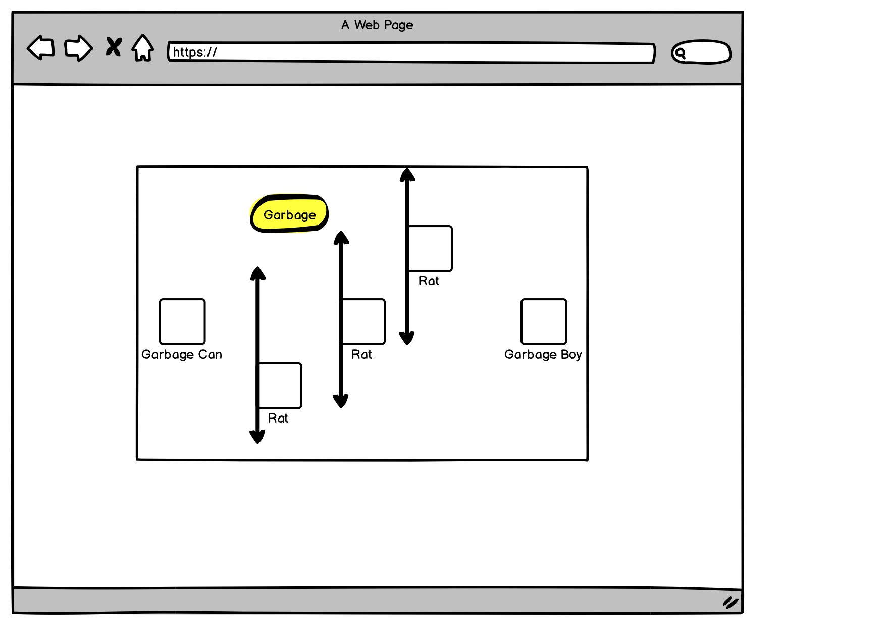
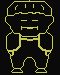

# Garbage Boy

## What's going on here? 

Garbage Boy is tired. All they want to do is get back to their cozy garbage home and catch some z's. BUT ALAS! There are a bunch of nasty rats running around, and Garbage Boy HATES rats. If they come in contact with a rat, they will LITERALLY die. 

Garbage Boy also hates littering. Make sure to pick up garbage on your way home, otherwise Garbage Boy will be sad. If Garbage Boy becomes too weighed down by the reality of their part in the destruction of our planet, they will not be able to continue on. Pro-tip: picking up garbage will not only keep Garbage Boy happy but will invigorate them and reward a stat boost by clicking on it in your inventory panel. Don't go using your garbage willy-nilly! Any unused garbage will be rolled over into the following level.

WATCH OUT for Big Ben. He's been known to periodically show his smug face around town, and he loathes Garbage Boy. 

TLDR: Move Garbage Boy with the WASD keys and navigate back home to their trash can without touching any of those nasty rats. Pick up garbage on your way home to keep Garbage Boy happy and gain some sick stat boosts by clicking on it in your inventory panel. 

[Play Game](https://d4vves.github.io/garbage-boy/)

## Wireframe

Check out how I planned out all of the amazing things Garbage Boy can do [here](https://hackmd.io/@d4vves/SJVPKrTn8). 

## MVP
- Create a CLI-like game screen
- Render a start screen with game-play instructions and a start button
- Render game screen displaying the canvas, GB's health
- Render a Garbage Boy character that can move freely using WASD keys
- Render GB's garbage can home which upon arrival will end the game
- Render three nasty rats at different X axis values that move up and down along the Y axis. If there is a collision, GB dies!
- Render a piece of garbage that when GB collides, it will be removed from the canvas
- If GB reaches their garbage can home without picking up the garbage collision will not happen

## Stretch Goals
- Every time you get GB to their home a new level will start
- Display current level
- Each level the rats movement speed will increase
- Picking up garbage will add it to GB's inventory, display inventory on game screen
- Ability to click on garbage in inventory to either make the rats movement pause for a few seconds or increase GB's movement speed depending on garbage type of water bottle or chocolate bar.
- Have rats spawn randomly on the canvas
- Have rats move randomly on the canvas
- Add Big Ben, the homing rat

## Notes
- This game was created using HTML5, CSS, and JavaScript.
- All artwork was created by myself using Gimp.
- All music and sound effects were created by myself using Garageband and the YMCK magical 8 bit plugin.

## Blooper Reel
- Garbage Boy sprite v.1

- I created a random Y variable for the rats to spawn at and expected each rat to magically have a different random Y variable. Thank you Pete for pointing out my shortcomings. 
- I spent the better part of a day trying to figure out the logic behind my rats moving up and down the Y axis. My sincerest apologies to Yoshi for attempting to help with said logic, only to realize 45 minutes later that I was assigning the up and down variables in my function rather than globally.
- I initially had three separate rat collision functions and three separate rat movement functions. I created a separate constructor for the rats that had the functions baked in.
- Getting the rats to move how I wanted them to was the hardest logic in this project. I went down a deep, dark path of many, many if statements to make a rat move in a certain direction and then change directions accordingly. Randomizing that seemed impossible. Then, after researching bouncing ball tutorials, I found out that you can reverse a value by assigning it as a negative, i.e. speed = -speed. That one little assigment completely changed how I was able to move my rats! I went from having four if statements to make the rats move solely along the Y axis, to having two if statements that made them move randomly along the X and Y axes. What a world. 