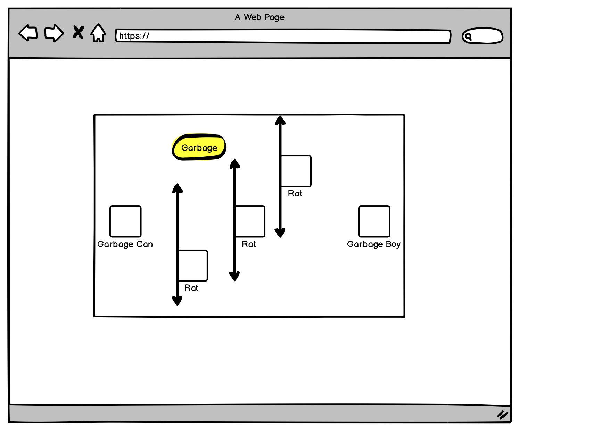

# Garbage Boy

## What's going on here? 

Garbage Boy is tired. All they want to do is get back to their cozy garbage home and catch some z's. BUT ALAS! There are a bunch of nasty rats running around, and Garbage Boy HATES rats. If they come in contact with a rat, they will LITERALLY die. 

Garbage Boy also hates littering. Make sure to pick up garbage on your way home, otherwise Garbage Boy will be sad. If Garbage Boy becomes too weighed down by the reality of their part in the destruction of our planet, they will not be able to continue on. //Pro-tip: picking up garbage will not only keep Garbage Boy happy but will invigorate them and reward a stat boost!

TLDR: Move Garbage Boy back home to their trash can without touching any of those nasty rats. Pick up garbage to keep Garbage Boy happy //and gain some sick stat boosts.

## MVP
- Create a CLI-like game screen
- Render a start screen with game-play instructions and a start button
- Render game screen displaying the canvas, GB's health
- Render a Garbage Boy character that can move freely using WASD keys
- Render GB's garbage can home which upon arrival will end the game
- Render three nasty rats at different X axis values that move up and down along the Y axis. If there is a collision, GB dies!
- Render a piece of garbage that when GB collides, it will be removed from the canvas
- If GB reaches their garbage can home without picking up the garbage collision will not happen

## Stretch Goals
- Every time you get GB to their home a new level will start
- Display current level
- Each level the rats movement speed will increase
- If GB collides with garbage can without picking up garbage, level will change but movement speed will be decreased
- Have rats spawn randomly on the canvas
- Have rats move randomly on the canvas
- Picking up garbage will add it to GB's inventory, display inventory on game screen
- Ability to click on garbage in inventory to either make the rats movement pause for a few seconds or increase GB's movement speed depending on garbage type of water bottle or chewing gum